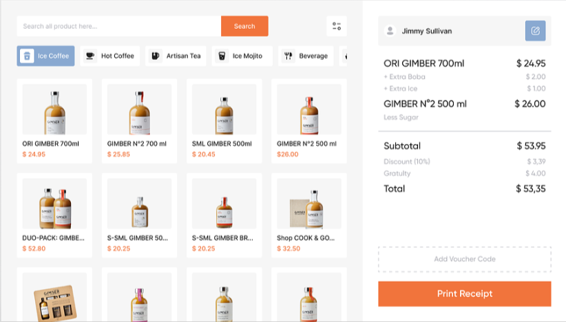

## Introduction
this is a company assignment given by Karkhana.io for their fronted role we have to clone the given image with add-to-cart functionality and many more...

## Assignment 

## Project Type
Frontend 

## Deployed App
https://667480d16a08c6ae49eb4bc6--karkhanafrontendassignmentshubhamlalw.netlify.app/

# screenshots of assignment

## Directory Structure
karkhanaAssignment_frontend/
- ├── public/
- │ ├── index.html
- │ ├── favicon.ico
- │ └── ...
- ├── src/
- │ ├── assets/
- │ │ ├── artisan.png
- │ │ ├── beverage.png
- │ │ ├── coffee.png
- │ │ ├── filter.png
- │ │ ├── hotTea.png
- │ │ ├── mojito.png
- │ │ ├── pen.png
- │ │ └── ...
- │ ├── components/
- │ │ ├── Cart.jsx
- │ │ ├── Filters.jsx
- │ │ ├── ProductList.jsx
- │ │ ├── SearchBar.jsx
- │ │ ├── Summary.jsx
- │ │ ├── UserProfile.jsx
- │ │ ├── Voucher.jsx
- │ │ └── ...
- │ ├── styles/
- │ │ ├── Cart.css
- │ │ ├── Filters.css
- │ │ ├── ProductList.css
- │ │ ├── SearchBar.css
- │ │ ├── Summary.css
- │ │ ├── UserProfile.css
- │ │ ├── Voucher.css
- │ │ └── ...
- │ ├── App.jsx
- │ ├── App.css
- │ ├── index.js
- │ └── ...
- ├── .gitignore
- ├── package.json
- ├── README.md
- └── ...

## Features
List out the key features of your application.

- add to-cart functionality
- remove products from the cart
- you can apply vouchers for more discount
- you can generate the total amount receipt through a popup msg

## Tech Stack
List and provide a brief overview of the technologies used in the project.

- reactjs
- javascript

